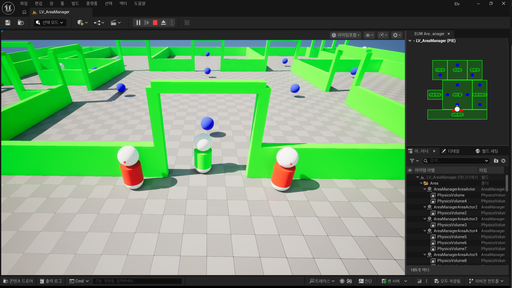
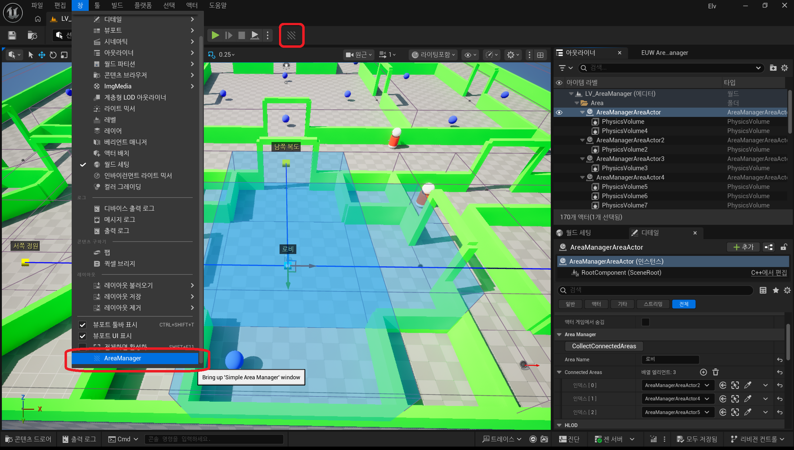
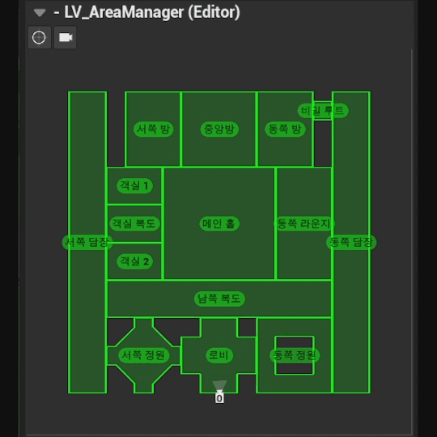
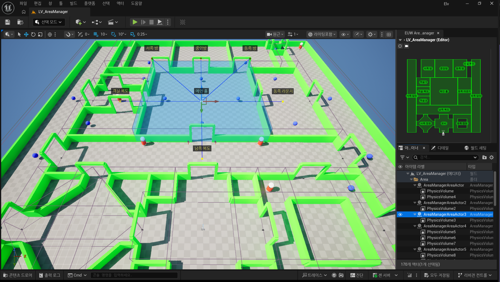
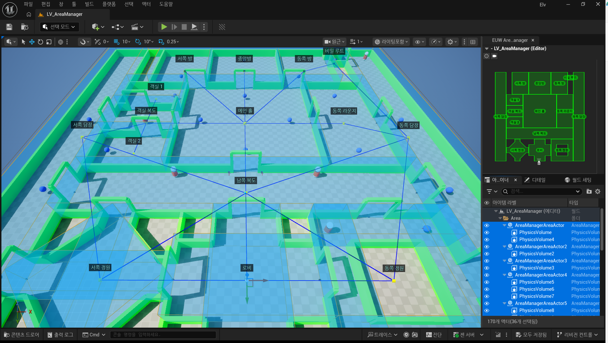
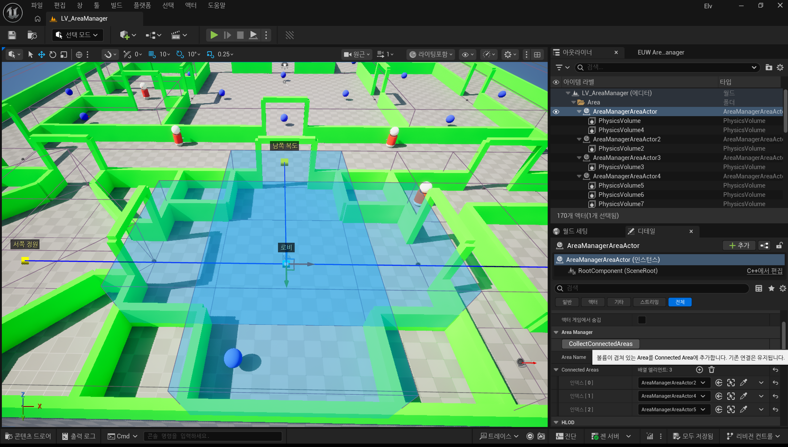

# UE5 Simple Area Manager

> Built as a lightweight area management plugin for Unreal Engine 5.

'Simple Area Manager'는 간단하게 레벨에 구역(Area)를 설정하고, 구역 내 액터(Member)를 관리하기 위한 Unreal EnGine 5 플러그인입니다.

Area Actor는 할당된 Volume Actor를 기반으로 Area 범위를 설정하고,

Area 내/외부로 이동하는 Member Actor(Player/NPC/Other Actors)를 추적, 관리합니다.

또한 Area 배치 현황 및 내부의 Member Actor를 시각화한 Editor/PIE 전용 Minimap 위젯을 제공합니다.

이 플러그인은 포트폴리오 목적으로 제작되었습니다.

---

## Features

- Area Actor를 이용한 구역 설정 및 관리 시스템 제공
- Volume Actor를 이용한 Area 범위 설정, Volume Overlap Event 기반의 Member Actor 입출입 관리.
- Area 및 Member 등록/해제에 대한 이벤트 제공

- Area 및 Member 데이터 기반의 유틸리티 위젯 제공 (Editor/PIE)
- Area 연결 상태를 보여주는 Editor Visualizer 제공

- 플러그인 샘플 콘텐츠 제공
- Git 저장소에는 샘플 콘텐츠가 포함된 대표 버전을 제공하며, Release에서는 샘플 포함 / 샘플 제외 패키지를 별도로 제공

---

## Why This Plugin?

넓은 오픈 월드에서 좁은 집 안까지, "현재 Actor가 어느 구역에 있는지"를 알아야 하는 경우가 자주 있습니다.

구역을 정의하고, 범위를 설정하고, 입출입하는 액터를 추적하기 위해선 그것을 관리할 시스템이 필수입니다.

이 플러그인은 다음과 같은 목표로 제작했습니다.

- 구역(Area)를 정의하고, 범위를 설정하기
- 추적할 액터(Member)를 정의하고, 행동을 감시하기
- Area Actor 및 Member Actor 정보를 취합/관리하기
- 취합된 Area 정보를 기반으로 배치 및 연결 상태를 시각화하여 제공하기

시스템 구현을 위한 최소한의 기능을 제작하였습니다.
타 플러그인 의존성을 최대한 낮춰, 어느 프로젝트에서든 쉽게 이용할 수 있게 제작하였습니다.

---

## Repository Structure

GitHub Release에서는 다음 두 가지 압축 파일을 제공합니다.

| File | Description |
| --- | --- |
| `SimpleAreaManager_1.0.zip` | 샘플 콘텐츠가 포함된 버전입니다. 플러그인 기능을 바로 확인하고 싶을 때 사용합니다. |
| `SimpleAreaManager_1.0_NoSample.zip` | 샘플 맵과 샘플 리소스를 제외한 버전입니다. 기존 프로젝트에 플러그인만 추가하고 싶을 때 사용합니다. |

---

## Core Classes

| Class | Parent | Role |
| --- | --- | --- |
| `AAreaManagerAreaActor` | Actor | Area를 정의하는 Actor입니다. 연결된 Volume에 따라 Area 범위가 설정됩니다. |
| `UAreaManagerMemberComponent` | ActorComponent | Area에서 추적할 Actor에 추가해야 하는 ActorComponent 입니다. |
| `UAreaManagerSubsystem` | WorldSubsystem | Area Actor와 Member Actor의 등록 상태를 관리하는 WorldSubsystem입니다. |
| `UAreaManagerFunctionLibrary` | BlueprintFunctionLibrary | 볼륨의 범위를 Minimap Widget에 표시하기 위한 Transform 계산 함수를 제공합니다. |
| `UAreaManagerEditorSubsystem` | EditorSubsystem | Editor/PIE 전환 및 맵 로드 등 에디터 이벤트를 제공합니다. |
| `FAreaManagerVisualizer` | ComponentVisualizer | Area Actor의 배치, 범위, 연결 상태를 Viewport에 표시하기 위한 Visualizer 입니다. |

---

## Installation

1. GitHub Release에서 원하는 압축 파일을 다운로드합니다.
   - 샘플 포함 버전: `SimpleAreaManager_1.0.zip`
   - 샘플 제외 버전: `SimpleAreaManager_1.0_NoSample.zip`
2. 압축을 해제한 뒤 `AreaManager` 폴더를 프로젝트의 `Plugins` 폴더에 복사합니다.
3. Unreal Editor를 실행합니다.
4. Plugins 창에서 `Simple Area Manager` 플러그인을 활성화합니다.
5. 프로젝트를 재시작합니다.

샘플 포함 버전은 `EnhancedInput` 플러그인을 사용합니다.
샘플 제외 버전은 샘플 맵과 샘플 리소스, `EnhancedInput` 의존성을 포함하지 않습니다.
샘플 포함 버전의 샘플 콘텐츠는 '.../AreaManager/Content/Sample/' 경로에 위치합니다.

---

## Basic Usage

1. 레벨에 `AreaManagerAreaActor`기반 액터를 배치합니다.
2. Area로 사용할 Volume Actor를 `AreaManagerAreaActor`에 Attach합니다.
3. `AreaName`을 설정합니다.
4. Area에 포함될 수 있는 Actor에 `AreaManagerMemberComponent`를 추가합니다.
5. 플레이를 시작하면 Area Actor가 Subsystem에 등록되고, Member Actor는 Overlap 상태에 따라 현재 Area를 갱신합니다.

Blueprint에서는 다음 함수를 사용할 수 있습니다.

| Function | Description |
| --- | --- |
| `FindAreaData` | AreaName으로 Area Data를 조회합니다. |
| `GetCurrentPlayerArea` | 현재 플레이어가 속한 Area를 반환합니다. |
| `GetAreaActors` | 지정한 범위의 Area Actor 목록을 반환합니다. |
| `GetAreaMembers` | 지정한 범위에 속한 Member Actor 목록을 반환합니다. |

---

## Editor Tools

### UI Content Overview

| Asset | Parent | Description |
| --- | --- | --- |
| `EUW_AreaManager`| 최상위 Editor Utility Widget입니다. |
| `EUW_AreaManager_Viewer`| Editor / PIE 전환과 레벨 변경 이벤트를 감지하고, 필요한 위젯을 활성화하는 관리자 Widget입니다. |
| `EUW_AreaManager_EditorMinimap`| Editor 모드 전용 미니맵입니다. 전체 Area 배치 현황과 활성 Viewport Camera 위치를 표시합니다. |
| `WB_AreaManager_Base`| AreaManager 플러그인 전용 위젯 템플릿입니다. Set / Reset / Clear / Draw / Refresh 함수를 제공합니다. |
| `WB_AreaManager_PIEMinimap`| PIE 모드 전용 미니맵입니다. 현재 Player가 속한 Area를 기준으로 연결된 Area와 내부 Member를 표시합니다. |
| `WB_AreaManager_AreaVolume`| Area 내 Volume 배치도를 시각화합니다. |
| `WB_AreaManager_Icon_EditorCamera`| 활성화된 Viewport Camera 위치를 표시하는 아이콘입니다. |
| `WB_AreaManager_Icon_Player` | 플레이어 위치 표시용 아이콘입니다. |
| `WB_AreaManager_Icon_Pawn` | Pawn Member 위치 표시용 아이콘입니다. |
| `WB_AreaManager_Icon_Member` | 기타 Member 위치 표시용 기본 아이콘입니다. |

#### Blueprint

| Asset | Description |
| --- | --- |
| `BP_AreaManager_FunctionLibrary` | 위젯 Pool 함수를 제공합니다. |

#### Material

| Asset | Description |
| --- | --- |
| `UIM_AreaManager_Outline` | 외곽선 표시용 UI 머티리얼입니다. |
| `UIMI_AreaManager_Outline_Area` | Area 영역 표시용 UI 머티리얼 인스턴스입니다. |

### Area Manager Window

Toolbar 또는 Window 메뉴에서 `AreaManager`를 실행할 수 있습니다.

Editor Utility Widget을 통해 Area 관련 에디터 도구와 예제 UI를 확인할 수 있습니다.

#### Area Editor Minimap

#### Area PIE Minimap

### Area Visualizer

Viewport에서 `AreaManagerAreaActor`를 선택하면 다음 정보를 시각적으로 확인할 수 있습니다.

- 선택된 Area 위치 및 범위
- 연결된 Area 위치
- Area 간 연결 관계

### Collect Connected Areas

기본적으로 Area 간 연결은 사용자가 직접 연결해야 합니다.

하지만 수많은 Area를 하나하나 연결하기는 번거롭기에, 편의성을 위한 `Collect Connected Areas` 함수를 제공합니다.

이 함수는 Area Volume 영역이 겹치는 Area를 모두 찾아 ConnectedAreas에 추가합니다.

---

## Recommended Use Cases

- 방 단위 Area 설정
- Area 진입/이탈 감지
- Area 연결 상태 확인
- Area 내 Member Actor 조회
- Editor 환경에서 Area 배치도 확인
- PIE 환경에서 Area 및 Member 위치 실시간 확인
- Player가 위치한 Area 기준으로 연출 변화
- 
---

## Notes

- `AreaName`은 중복되지 않게 설정하는 것을 권장합니다.
- 샘플 콘텐츠는 사용 예시를 보여주기 위한 목적으로 포함되어 있습니다.

---

## Design Note

이 플러그인은 포트폴리오 목적으로 제작되었습니다.

Editor Utility Widget 제작을 위해 필요한 Area Manager System을 추가하였으며, 그 때문에 AreaManager는 Area 관리를 위해 최소한의 기능만 구현했습니다.

---

## Current Status

- Portfolio project
- Runtime + Editor plugin
- Developed with Unreal Engine 5.7
- Release provides sample and no-sample packages
- MIT License

---

## License

This project is licensed under the MIT License.
